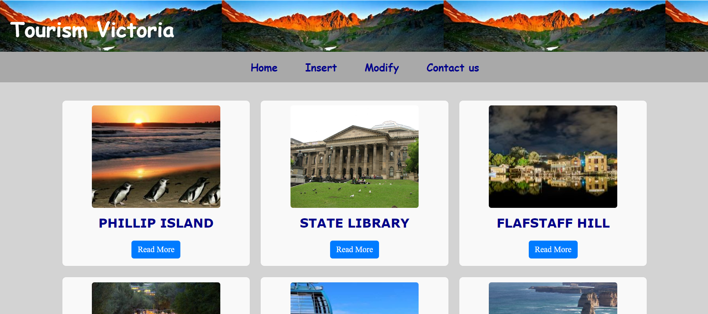
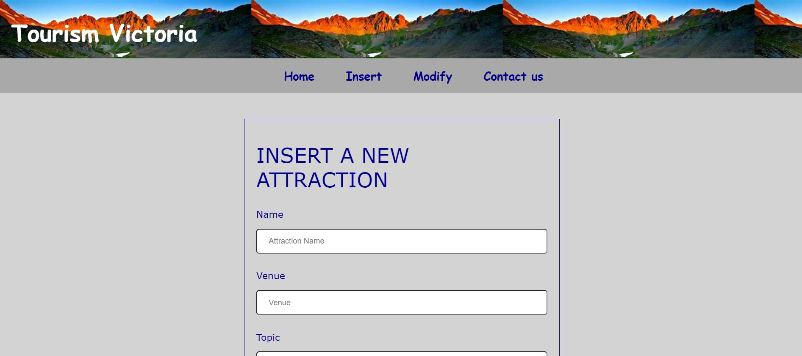
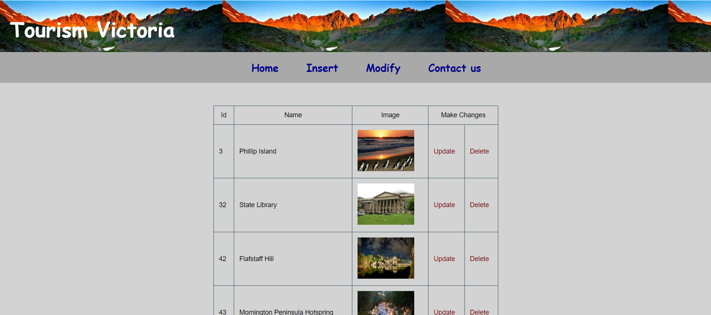

# web_development_victoria_tourism

In this project I built a website for Victoria tourism using PHP, MySQL for backend and HTML, CSS for front-end.

This website allows tourists to see attractions in Victoria. These attractions can be inserted and modified using the admin account.

Following are some screenshots of my website.

## Home page

## Insert page

## Modify page

